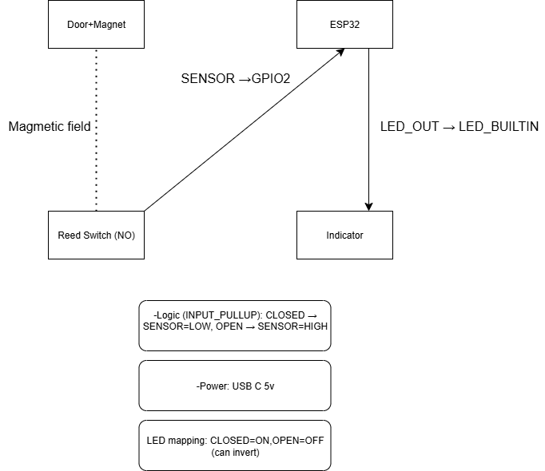

# Door Lock Status (חיווי נעילת דלת בריח)

Starter structure for a door-lock status indicator using a reed switch + magnet and Arduino/ESP32.

## Why this skeleton?
- Clean folders: `hardware/`, `firmware/`, `docs/`, `test/`
- Ready `.gitignore`
- Simple CI (GitHub Actions)
- Keep code comments short and in English

## Folders
- `hardware/` – wiring, BOM, photos.
- `firmware/` – MCU code (Arduino/ESP32).
- `docs/` – notes and decisions.
- `test/` – quick checks.

## Roadmap (example)
- [ ] MVP: LED shows locked/unlocked
- [ ] Buzzer when door left open
- [ ] Optional: phone notification
- [ ] Enclosure tidy-up

## License
MIT (already in your repo).

Setup confirmed via GitHub Desktop.

## Architecture (Block Diagram)

## Real wiring (MVP)

**Setup (photo):**
- Board: ESP32 DevKitC
- Sensor: Reed switch (NO), between **GPIO21** and **GND** (using `INPUT_PULLUP`)
- LED: **GPIO2** (onboard) — or external LED with 220Ω → GND
- Power: USB 5V
- Logic (INPUT_PULLUP): **CLOSED → LOW**, **OPEN → HIGH**
- Magnet distance ~5–10 mm; face labeled for consistent closure

