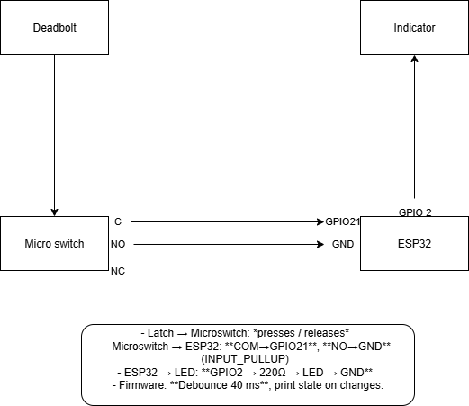

# Door Lock Status
Starter structure for a door-lock status indicator using a **microswitch (SPDT lever)** and Arduino/ESP32.

## Why this skeleton?
- Clean folders: `hardware/`, `firmware/`, `docs/`, `test/`
- Ready `.gitignore`
- Simple CI (GitHub Actions)
- Keep code comments short and in English

## Folders
- `hardware/` – wiring, BOM, photos.
- `firmware/` – MCU code (Arduino/ESP32).
- `docs/` – notes and decisions.
- `test/` – quick checks.

## Roadmap 
- [ ] MVP: LED shows locked/unlocked
- [ ] Buzzer when door left open
- [ ] Optional: phone notification
- [ ] Enclosure tidy-up

## License
MIT 

Setup confirmed via GitHub Desktop.

## Architecture (Block Diagram)

## Real wiring (MVP)

**Caption:** ESP32 DevKitC with microswitch **COM→GPIO21**, **NO→GND** (GPIO21 as `INPUT_PULLUP`).  
LED on **GPIO2 → 220Ω → GND**.  
Logic: **LOCKED = HIGH**, **UNLOCKED = LOW**. Debounce: **40 ms**.  
*(If your latch presses the lever when locked, swap NO↔NC to keep LOCKED = HIGH.)*

**Setup (photo):**
- **Board:** ESP32 DevKitC
- **Sensor:** Microswitch (SPDT lever), wired so that **LOCKED reads HIGH** with `INPUT_PULLUP`.
  - **COM → GPIO21**
  - **NO  → GND**  (lever NOT pressed when locked → pin is OPEN → HIGH)
  - If your latch **presses** the lever when locked, use **NC → GND** instead (to keep LOCKED = HIGH).
- **ESP32 pin config:** `SENSOR_PIN = GPIO21` configured as `INPUT_PULLUP`
- **LED:** `GPIO2` (onboard) — or external: `GPIO2 → 220Ω → LED anode → GND`
- **Power:** USB 5V
- **Logic (INPUT_PULLUP):** **LOCKED → HIGH**, **UNLOCKED → LOW**
- **Debounce:** 40 ms

### Phone UI (Local Web over STA)

**Goal:** View the door state on a phone over the home Wi-Fi (no internet required).

**How to access**
1. Power the ESP32 and let it join the home Wi-Fi (STA mode).
2. Find its IP on the LAN (see below).
3. On your phone (same Wi-Fi), open `http://<ESP32-IP>/`.
4. The page shows the state and auto-updates.
   - Text is exactly: **Locked** or **Unlock**.

**Find the ESP32 IP**
- **Serial Monitor:** on boot, the firmware prints the assigned IP (DHCP).
- **Router UI / App:** check the connected devices list.
- **Network scanner:** e.g., Fing app on the phone (scan the LAN).

**Direct status endpoint**
- `http://<ESP32-IP>/status` → returns **Locked** or **Unlock** (`text/plain`, not cached).

**Troubleshooting**
- Phone and ESP32 must be on the **same Wi-Fi/LAN**.
- If the page doesn’t load: verify the IP hasn’t changed; try airplane mode ON then Wi-Fi ON (prevents cellular “smart switch”).
- Use **http** (not https) for local access.
- Some routers rotate IPs; re-check after reboot.

**Security (MVP)**
- Local LAN only. No internet exposure. For now, no login on the page.

**Out of scope (later)**
- Remote access outside home, HTTPS/TLS, auth, mDNS hostname, Wi-Fi config portal.
# ESP32 Wi-Fi (STA) — How it works

## Lifecycle
1) Boot → bring up radio
2) Scan → find SSID
3) Join + WPA2-PSK handshake
4) DHCP → get IP/Gateway/DNS
5) Online (LAN)

## Requirements
- 2.4 GHz enabled, WPA2-PSK (AES), no captive portal
- Phone and ESP32 on the same LAN (no guest isolation)
- Exact SSID/password

## Verify
- Router “Connected devices”: ESP32 appears with an IP
- Optional: ping the IP from phone/PC
- Next: set a DHCP reservation for a stable local IP

## Common Issues
- Wrong SSID/password → fix exact spelling/case
- 5 GHz only → enable/split 2.4 GHz SSID (or IoT/Guest 2.4)
- Guest isolation → disable or avoid guest network
- WPA3-only/Portal → allow WPA2-PSK, remove portal
- Weak RSSI → move closer / use channels 1/6/11 @ 20 MHz

## Security
- Keep Wi-Fi creds locally (ignored by git)
- LAN-only access for the MVP

- The UI reflects **Locked/Unlock** within ≤ 1 s from a sensor change (incl. debounce + polling).

