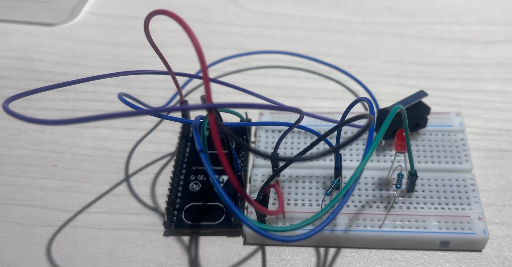
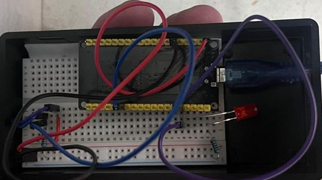
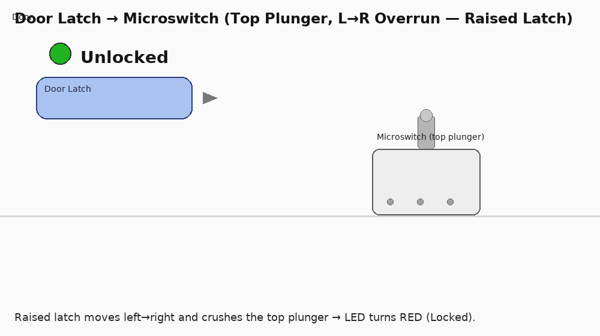
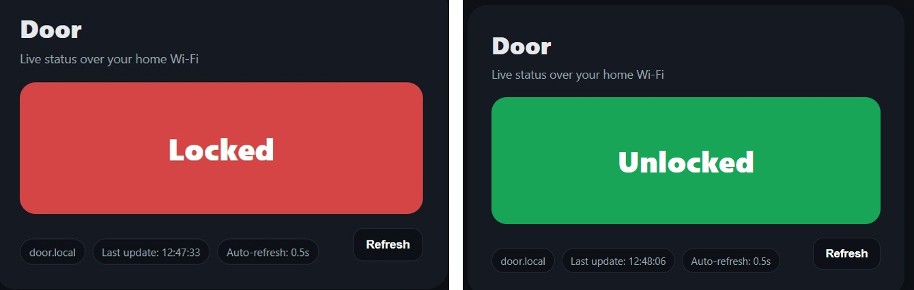
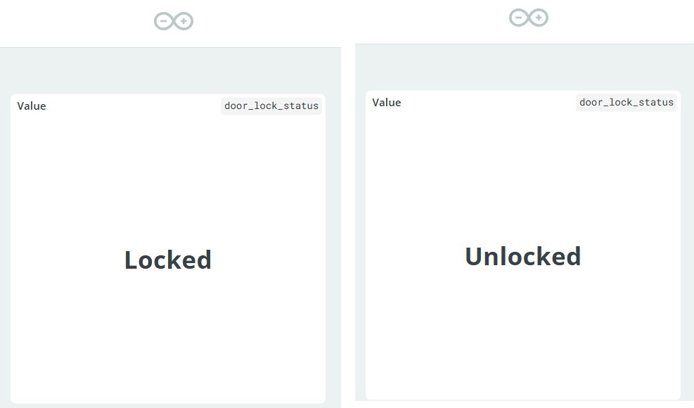

# Door Lock Status
Starter structure for a door-lock status indicator using a **microswitch (SPDT lever)** and Arduino/ESP32.

## Why this skeleton?
- Clean folders: `hardware/`, `firmware/`, `docs/`, `test/`
- Ready `.gitignore`
- Simple CI (GitHub Actions)
- Keep code comments short and in English

## Folders
- `hardware/` – wiring, BOM, photos.
- `firmware/` – MCU code (Arduino/ESP32).
- `docs/` – notes and decisions.
- `test/` – quick checks.

## Roadmap 
- [ ] MVP: LED shows locked/unlocked ,phone notification.
- [ ] Installtion on house door.

## License
MIT 

## Architecture (Block Diagram)


## Real wiring (MVP)

.

## Animation
.

**Caption:** ESP32 DevKitC with microswitch **COM→GPIO21**, **NO→GND** (GPIO21 as `INPUT_PULLUP`).  
LED on **GPIO2 → 220Ω → GND**.  
Logic: **LOCKED = HIGH**, **UNLOCKED = LOW**. Debounce: **40 ms**.  
*(If your latch presses the lever when locked, swap NO↔NC to keep LOCKED = HIGH.)*


**Setup :**
- **Board:** ESP32 DevKitC
- **Sensor:** Microswitch (SPDT lever), wired so that **LOCKED reads HIGH** with `INPUT_PULLUP`.
  - **COM → GPIO21**
  - **NO  → GND**  (lever NOT pressed when locked → pin is OPEN → HIGH)
  - If your latch **presses** the lever when locked, use **NC → GND** instead (to keep LOCKED = HIGH).
- **ESP32 pin config:** `SENSOR_PIN = GPIO21` configured as `INPUT_PULLUP`
- **LED:** `GPIO2` (onboard) — or external: `GPIO2 → 220Ω → LED anode → GND`
- **Power:** USB 5V
- **Logic (INPUT_PULLUP):** **LOCKED → HIGH**, **UNLOCKED → LOW**
- **Debounce:** 40 ms

## Phone UI (door.local) — Quickstart

**Goal:** View the door state from your phone over your home Wi-Fi.  
**Address:** `http://door.local` (mDNS) — no static IP required.

### Requirements
- ESP32 on 2.4 GHz Wi-Fi (WPA2-PSK).
- `secrets.h` locally with correct SSID/PASS (do not commit).
- Firmware flashed (`firmware/door_lock_mvp/door_lock_mvp.ino`) with mDNS enabled.

### How to access
- **Preferred:** open **`http://door.local`** from a phone on the same SSID/LAN (not Guest/Isolation).
- **Fallback:** open `http://<IP-from-Serial>/` (printed after boot in Serial Monitor).

### Endpoints
- `GET /` → HTML mobile UI (auto-refresh every 0.5 s)
- `GET /status` → `Unlock` or `Locked` (`text/plain`, `Cache-Control: no-store`)
- `GET /api/status` → JSON  
  `{ "locked": bool, "label": "Unlock|Locked", "sensor_gpio": 21, "led_gpio": 2, "uptime_ms": <number> }`
- `GET /api/health` → `ok`
- `GET /api/info` → JSON  
  `{ "hostname": "door", "ip": "...", "mac": "...", "rssi": <dBm>, "version": "1.0.0" }`

### Status semantics (MVP)
- `Unlock` ↔ sensor **LOW** (microswitch pressed/closed)  
- `Locked` ↔ sensor **HIGH** (microswitch released/open)  
- Serial logs print `CLOSED` / `OPEN` (raw switch semantics)

### Test (manual)
1. Flash and open Serial (115200) → look for `mDNS: http://door.local`.
2. On your phone: open `http://door.local` and verify the label/color.
3. Toggle the microswitch → status updates within ≤ 1 s.
4. Optional checks:  
   `curl http://door.local/status` • `curl http://door.local/api/status`

### Troubleshooting
- Phone and ESP32 must be on the **same SSID** (not Guest/Isolation).
- If `door.local` doesn’t resolve, use the printed IP and verify mDNS on your LAN.
- Keep `secrets.h` out of Git (add to `.gitignore`).

### Notes
- Static IP is **optional**. If you want one later, set a DHCP reservation in your router (no firmware changes needed).

###


## Arduino Cloud Dashboard (optional)

**Goal:** Mirror the door state to Arduino Cloud so the dashboard shows:
- **Status** (green/red) bound to **`isLocked`** (Bool)
- **Value** (text) bound to **`lockText`** (String): `"Locked"` / `"Unlock"`

### Cloud variables (Thing)
| Name       | Type   | Permission | Update policy | Notes                                                 |
|------------|--------|------------|---------------|--------------------------------------------------------|
| `isLocked` | Bool   | READWRITE  | On change     | Callback `onIsLockedChange()` ignores remote writes.   |
| `lockText` | String | READ       | On change     | Shows “Locked/Unlock” in a Value widget.               |

### Dashboard screenshot



### Firmware touchpoints

```cpp
// includes
#include <ArduinoIoTCloud.h>
#include "arduino_secrets.h"
#include "thingProperties.h"

// setup()
initProperties();
ArduinoCloud.begin(ArduinoIoTPreferredConnection);

// loop()
ArduinoCloud.update(); // keep cloud in sync

// On debounced state change:
bool locked = (stableState == HIGH);        // HIGH = Locked (project decision)
isLocked = locked;                          // dashboard boolean
lockText = locked ? "Locked" : "Unlocked";  // dashboard text

// Callback (ignore remote writes):
void onIsLockedChange() { /* hardware-driven only */ }


