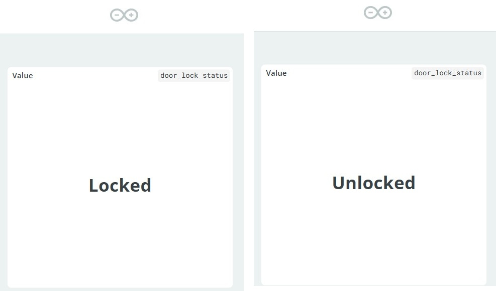
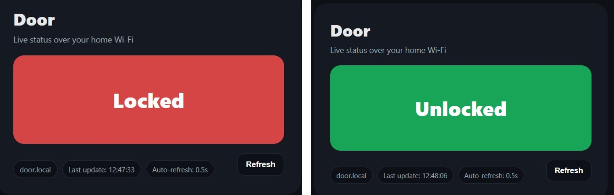

# 🚪 Door Lock Detector Project  

Welcome to my IoT project!  
This page presents a simple yet functional **door lock status indicator** based on ESP32.  

---

## 🔧 Hardware Setup
- **Board:** ESP32 DevKitC  
- **Sensor:** Microswitch (connected to GPIO21 with INPUT_PULLUP)  
- **LED Indicator:** GPIO2 (ON when locked)  
- **Debounce:** 40 ms  
- **Serial Baud:** 115200  

---

## 📊 System Diagram

---

## 📜 Features
- Local LED lock/unlock indicator  
- Serial log for debugging (OPEN/CLOSED)  
- HTTP endpoint for phone UI (local Wi-Fi)  
- Arduino IoT Cloud integration for remote dashboard  

---

## 📂 Repository
You can explore the full source code, documentation, and hardware photos here:  
👉 [View on GitHub](https://github.com/IdanWeissberg/Door-lock-status)

---

## 🧪 Test Logs
- ✅ Boot with door closed → LED ON  
- ✅ Toggle open/close → state detected correctly  
- ✅ Idle stability after 60s → OK  
- ✅ HTTP status endpoint → OK  
- ✅ Arduino Cloud dashboard → OK  

---

## 📸 Screenshots

